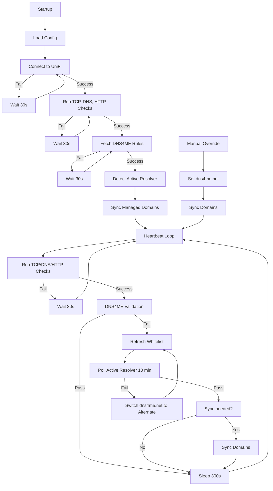

# DNS4ME ↔ UniFi Sync & Failover Design

## Overview

This document describes the architecture and flow for syncing DNS4ME dnsmasq forward domains into UniFi forward-domain entries, while avoiding sending all DNS traffic to DNS4ME.

---

## Key Principles

- Active resolver = resolver used by `dns4me.net` in UniFi
- Alternate resolver = the other resolver
- No preferred resolver
- In automatic mode, never switch all managed domains until validation passes
- Sync applies desired DNS4ME rules to UniFi and does not validate resolver health
- Heartbeat validates and recovers
- Manual override forces state
- `state.json` contains every UniFi DNS entry written by this tool

---

## Startup Flow

```text
load config
→ connect to UniFi (retry)
→ run TCP/DNS/HTTP checks (retry)
→ fetch DNS4ME rules (retry)
→ detect active resolver
→ sync managed domains to active resolver
→ start heartbeat loop
```

Startup does not perform failover.

Startup can block forever by design. The daemon should not enter normal operation until UniFi, general internet/DNS/HTTP checks, and DNS4ME rule fetching are available.

---

## Pre-flight Checks

Must include:

- TCP connectivity
- DNS resolution
- HTTP validation

If any fail:

```text
log
→ wait 30s
→ retry
```

---

## Sync Engine

```text
fetch rules
→ convert dnsmasq → UniFi rules
→ apply resolver
→ create/update/delete managed rules
→ save state
```

Sync does not validate resolver health.

### State Rules

- `state.json` records every UniFi Forward Domain entry written by this tool.
- Sync only deletes entries that are present in `state.json` or are duplicate DNS4ME entries for a managed domain.
- Manual UniFi Forward Domain entries that are not tracked in `state.json` are left alone unless they are duplicates for a managed DNS4ME domain.
- If an entry from `state.json` exists in UniFi but points to the wrong DNS4ME resolver, sync updates it to the current resolver.
- If multiple UniFi Forward Domain entries exist for one managed DNS name:
  - keep one entry that matches the current resolver
  - delete all other entries for that managed DNS name
  - create one matching entry if none match the current resolver
- After a successful non-dry-run sync, `state.json` is rewritten to match the managed entries the tool expects to own.

---

## Heartbeat Loop

```text
run TCP, DNS, HTTP checks
→ if fail: wait 30s → retry

run dns4me.net validation
→ if pass: sleep 300s → repeat
→ if fail: enter resolver validation loop
```

---

## Resolver Validation Loop

```text
refresh whitelist
→ poll active resolver every 15s for 10 mins

if pass:
    sync if needed
    sleep 300s

if fail:
    set dns4me.net → alternate resolver
    repeat loop
```

This creates a continuous validation loop between the available DNS4ME resolvers.

The `dns4me.net` UniFi entry is allowed to move before validation because it is the marker used to test a candidate resolver. The safety rule is that automatic mode must not switch all managed domains until the current `dns4me.net` candidate passes DNS4ME validation.

Expected two-resolver loop:

```text
resolver 1 fails
→ write resolver 2 to dns4me.net
→ validate resolver 2

if resolver 2 passes:
    sync managed domains to resolver 2

if resolver 2 fails:
    write resolver 1 to dns4me.net
    validate resolver 1
    repeat
```

---

## Manual Override

```text
set dns4me.net → requested resolver
→ sync all managed domains
→ return to heartbeat loop
```

Manual override skips validation and lets heartbeat recover if needed.

The "never switch all domains until validation passes" rule only applies to automatic heartbeat recovery. Manual override is an operator decision and forces the requested resolver into both `dns4me.net` and the managed domain set.

---

## Timing Configuration

Keep runtime timing configuration deliberately small:

Fixed implementation timings:

- prerequisite retry wait: 30 seconds
- DNS4ME validation poll interval: 15 seconds

Configurable timings:

- heartbeat interval: default 5 minutes
- DNS4ME resolver validation window: default 10 minutes

---

## Mermaid Flow Diagram



---

## Final Mental Model

```text
Startup:
    initialise and sync

Heartbeat:
    validate → recover → loop

Resolvers:
    equal peers

Manual:
    force state

Sync:
    apply only
```
